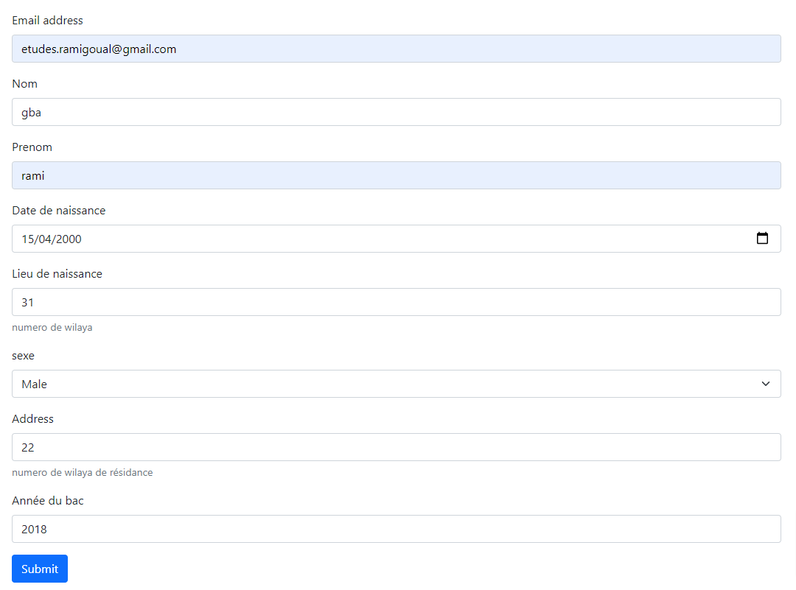

# TP-3 ISI

## Sur le projet

alors j'ai fait le projet comme une petite application web avec un front qui communique avec une REST-API basée sur node.js avec une architecture MVC

## Mode D'utilisation

alors l'utilisateur rempli le formulaire et si les infos sont correctes un utilisateur est créer dans fichier json

exemple: formulaire


exemple: utilisateur

```json
{
    "nom": "ahmed",
    "prenom": "rami",
    "sex": 0,
    "dateNaissance": "15-04-2000",
    "lieuNaissance": 31,
    "address": 31,
    "anneBac": 2018,
    "email": "hi@hi.com",
    "id": 0,
    "code": "2018-15-04-2000-31-m-0"
}
```

## Controle d'entries et gestion d'erreurs

alors de divers controles sont effectués comme: "presence, vraisemblance, type"

si tout les tests sont passée un utilisateurs est créé dans le fichier students.json sinon une erreur http est déclenché avec le code d'erreur 400 et un message indiquant le type d'erreur

### exemple sur les tests effectués

```javascript
// ses fonctions de test on une structure similaires

//si le test est passé on retourne un objet comportent une attribut success: {success: true}

//si le test échoue on retourne un objet comportent une attribut error: {error: "message"}
//et le msg est retourné à l'utilisateur

const email = (mail) => {
    //On vérifie l'email avec une regular expression
    const re =
        /^[a-zA-Z0-9.!#$%&'*+/=?^_`{|}~-]+@[a-zA-Z0-9-]+(?:\.[a-zA-Z0-9-]+)*$/;
    if (!re.test(mail.toLowerCase())) {
        return { error: "not valid wilaya" };
    }
    return { success: true };
};

const address = (wilaya) => {
    if (wilaya > 48 && wilaya < 1) return { error: "not valid wilaya" };

    return { success: true };
};

const date = (date) => {
    const isDate = new Date(date);

    if (isDate == "Invalid Date") return { error: "not valid date" };

    return { success: true };
};

const minLength = (str, length) => {
    if (str.length < length) return { error: `minimum length is ${length}` };

    return { success: true };
};
```

### exemple d'une requete qui échoue:

```javascript
//on verifie que le nom comporte minimum 2 caractères

//si la fonction ne retourne pas un succées elle retourne une erreur
if (!verify.minLength(req.body.nom, 2).success) {
    const error = verify.minLength(req.body.nom, 2).error;
    //échec de test une erreure est envoyée
    return res.status(400).send(error);
}
//... d'autres sont effectuées de meme maniere avantde creer utilisateur
```

## Créeation d'utilisateur

alors c'est la classe student qui représente notre Modèle étudiant qui vas créer un étudiant:

```javascript
class Student {
    constructor(
        nom,
        prenom,
        sex,
        dateNaissance,
        lieuNaissance,
        email,
        address,
        anneBac
    )

    //retoune tout les etudiant dans le fichier students.json
    static async findAll()

    //cette methode sauvegarde l'objet dans le fichier students.json
    async save()

    //cette methode génère le code articulé
    //le code est de form {anneeBac-dateNaissance-lieuNaissance-sex-idSequentiel}
    generateCode() {
        let code = `${this.anneBac}-${this.dateNaissance}-${this.lieuNaissance}-${this.sex}-${this.id}`;
        this.code = code;
    }
}
```

### exemple créeation utilisateur

```javascript
//ce fragement de code vient aprés que tout les tests ont passés avec succèes
async (req, res) => {
    let {
        nom,
        prenom,
        sex,
        dateNaissance,
        lieuNaissance,
        email,
        address,
        anneBac,
    } = req.body;

    try {
        const student = new Student(
            nom,
            prenom,
            sex,
            dateNaissance,
            lieuNaissance,
            email,
            address,
            anneBac
        );
        await student.save();
        res.status(201).send(student);
    } catch (error) {
        res.status(500).send(error);
    }
};
```
